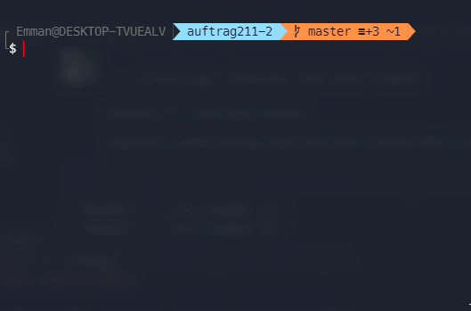

# keshi

A simple CLI for running commands concurrently.

Made for laravel but works with everything.



## Installation

`yarn global add keshi-cli`

`npm install keshi-cli --global`

## Usage

For starting everything you just need to run the command `keshi`.

Keshi will then searches for a `keshi.default.js` with tasks, if it doesn't exist, the default built in commands will be used.

### Commands

`keshi` - Just starts all tasks concurrently

`keshi -p <name>` - Start all tasks from the preset

`keshi init` - Create default config file

`keshi create` - Create a new preset

`keshi list` - List available presets

`keshi delete <name>` - Delete a preset

`keshi --help` - Overview of all commands with options

`keshi --version` - See version

### Config

The default looks like this if you generate it with `keshi init`.

```js
module.exports = {
  preset: '',
  tasks: {
    laravel: 'php artisan serve',
    vue: 'yarn dev',
  },
};
```

You can set preset to a name of one of your presets.

## Presets

Your presets are saved in your user home in `.keshirc` or `.keshirc.json`.

### Premade presets

Premade presets for certain development environments.

#### Laravel

You can find a premade presets for laravel development [here](./presets/laravel-development.json).

## Goal

I originally developed this tool for this purpose, so that I don't have to open multiple terminals each time when programming Laravel apps with VueJS.

## Security

If you discover any security related issues, please email mail@emmanuel-lampe.de instead of using the issue tracker.

## Credits

- [Emmanuel Lampe](https://github.com/rexlmanu)
- [All Contributors](../../contributors)

## License

The MIT License (MIT). Please see [License File](LICENSE.md) for more information.
